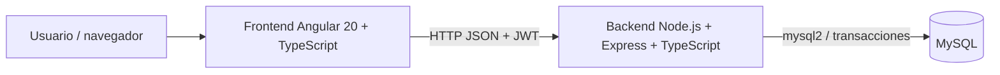
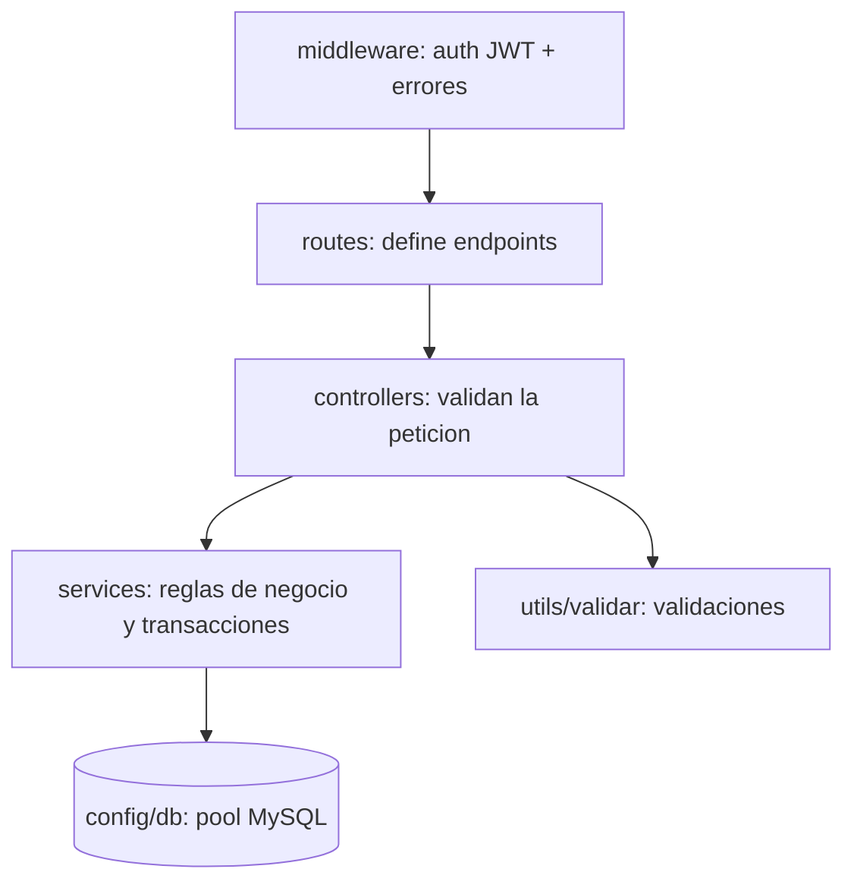

# Arquitectura

Arquitectura cliente-servidor en tres capas, con separación de frontend, backend y base de datos.

## Capas del backend

| Carpeta | Responsabilidad |
|---|---|
| `backend/src/config` | Variables de entorno, pool MySQL, inicialización de la BD |
| `backend/src/routes` | Rutas REST por recurso |
| `backend/src/controllers` | Reciben la petición, validan y responden |
| `backend/src/services` | Depósitos, retiros y transferencias (transacciones) |
| `backend/src/middleware` | Autenticación JWT y manejo de errores |
| `frontend/src/app/core` | Servicios (API, sesión, tema), guardia e interceptor |
| `frontend/src/app/pages` | Pantallas: login, resumen, clientes, cuentas, operaciones, movimientos, consultas |
| `frontend/src/app/shared` | Selector de apariencia y pipe de tipos de movimiento |

## Decisiones técnicas
- **JWT** sin estado: el token viaja en `Authorization: Bearer`. Las contraseñas se guardan con **bcrypt**.
- **Transacciones** con `SELECT ... FOR UPDATE`: evitan saldos inconsistentes en operaciones concurrentes. En transferencias las cuentas se bloquean en orden ascendente por ID para evitar interbloqueos.
- **Tema**: variables CSS por tema (`data-theme`) y color (`data-accent`) en `<html>`; el modo automático evalúa la hora local cada 30 segundos.
- **Despliegue**: en producción el backend sirve también el frontend compilado (un solo servicio en Render).
