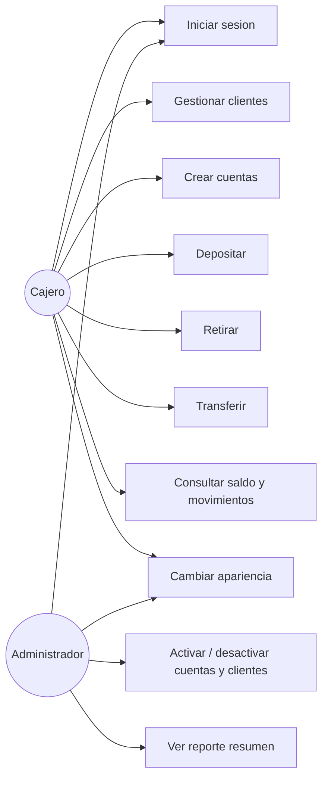
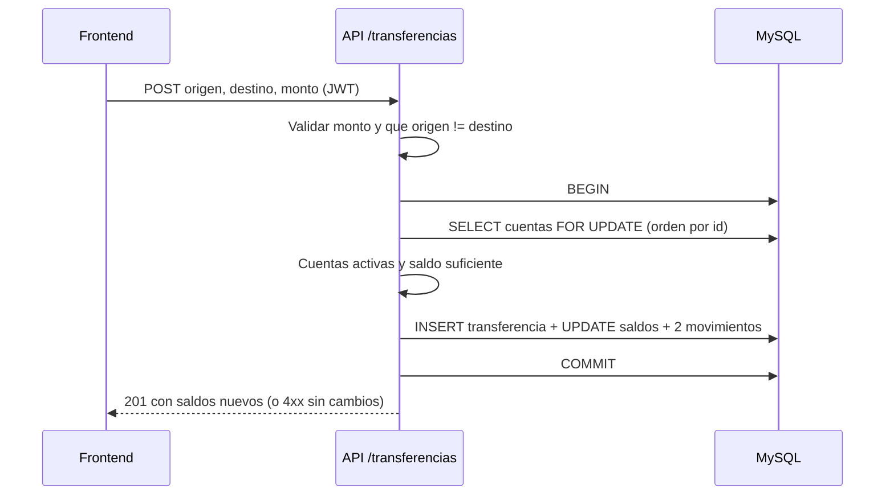
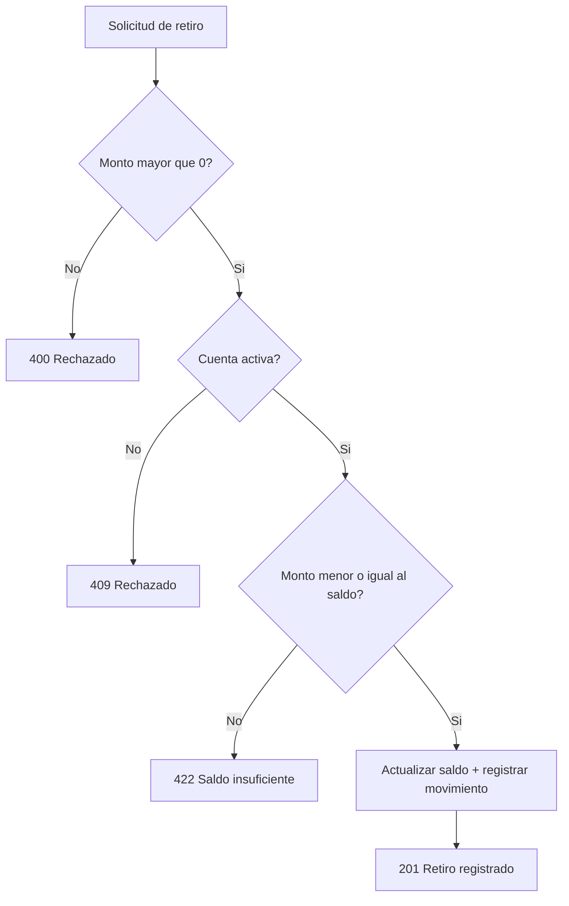
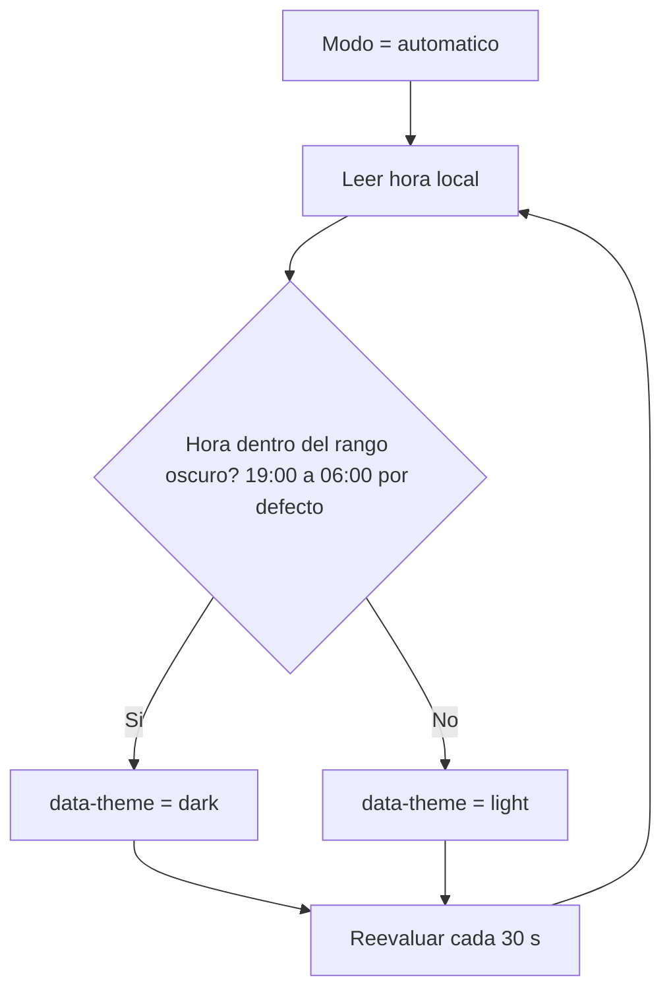

# Casos de uso y flujos

## Casos de uso

```mermaid
flowchart LR
  Cajero((Cajero)) --> A[Iniciar sesion]
  Cajero --> B[Gestionar clientes]
  Cajero --> C[Crear cuentas]
  Cajero --> D[Depositar]
  Cajero --> E[Retirar]
  Cajero --> F[Transferir]
  Cajero --> G[Consultar saldo y movimientos]
  Admin((Administrador)) --> A
  Admin --> H[Activar / desactivar cuentas y clientes]
  Admin --> I[Ver reporte resumen]
  Cajero --> J[Cambiar apariencia]
  Admin --> J
```

## Flujo de una transferencia

```mermaid
sequenceDiagram
  participant UI as Frontend
  participant API as API /transferencias
  participant DB as MySQL
  UI->>API: POST origen, destino, monto (JWT)
  API->>API: Validar monto y que origen != destino
  API->>DB: BEGIN
  API->>DB: SELECT cuentas FOR UPDATE (orden por id)
  API->>API: Cuentas activas y saldo suficiente
  API->>DB: INSERT transferencia + UPDATE saldos + 2 movimientos
  API->>DB: COMMIT
  API-->>UI: 201 con saldos nuevos (o 4xx sin cambios)
```

## Flujo de retiro

```mermaid
flowchart TD
  A[Solicitud de retiro] --> B{Monto mayor que 0?}
  B -- No --> X[400 Rechazado]
  B -- Si --> C{Cuenta activa?}
  C -- No --> Y[409 Rechazado]
  C -- Si --> D{Monto menor o igual al saldo?}
  D -- No --> Z[422 Saldo insuficiente]
  D -- Si --> E[Actualizar saldo + registrar movimiento]
  E --> F[201 Retiro registrado]
```

## Flujo del tema automático

```mermaid
flowchart TD
  A[Modo = automatico] --> B[Leer hora local]
  B --> C{Hora dentro del rango oscuro? 19:00 a 06:00 por defecto}
  C -- Si --> D[data-theme = dark]
  C -- No --> E[data-theme = light]
  D --> F[Reevaluar cada 30 s]
  E --> F
  F --> B
```
