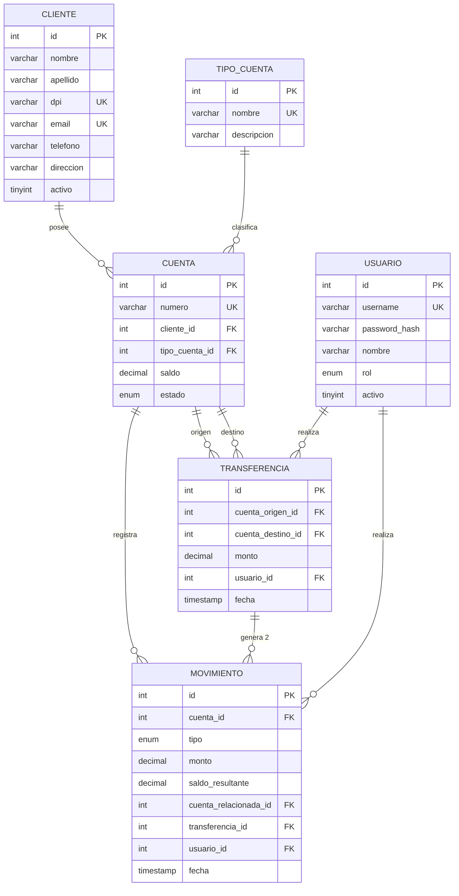

# Diagrama entidad-relación (ERD)

```mermaid
erDiagram
  CLIENTE ||--o{ CUENTA : "posee"
  TIPO_CUENTA ||--o{ CUENTA : "clasifica"
  CUENTA ||--o{ MOVIMIENTO : "registra"
  CUENTA ||--o{ TRANSFERENCIA : "origen"
  CUENTA ||--o{ TRANSFERENCIA : "destino"
  TRANSFERENCIA ||--o{ MOVIMIENTO : "genera 2"
  USUARIO ||--o{ MOVIMIENTO : "realiza"
  USUARIO ||--o{ TRANSFERENCIA : "realiza"

  CLIENTE {
    int id PK
    varchar nombre
    varchar apellido
    varchar dpi UK
    varchar email UK
    varchar telefono
    varchar direccion
    tinyint activo
  }
  USUARIO {
    int id PK
    varchar username UK
    varchar password_hash
    varchar nombre
    enum rol
    tinyint activo
  }
  TIPO_CUENTA {
    int id PK
    varchar nombre UK
    varchar descripcion
  }
  CUENTA {
    int id PK
    varchar numero UK
    int cliente_id FK
    int tipo_cuenta_id FK
    decimal saldo
    enum estado
  }
  TRANSFERENCIA {
    int id PK
    int cuenta_origen_id FK
    int cuenta_destino_id FK
    decimal monto
    int usuario_id FK
    timestamp fecha
  }
  MOVIMIENTO {
    int id PK
    int cuenta_id FK
    enum tipo
    decimal monto
    decimal saldo_resultante
    int cuenta_relacionada_id FK
    int transferencia_id FK
    int usuario_id FK
    timestamp fecha
  }
```
